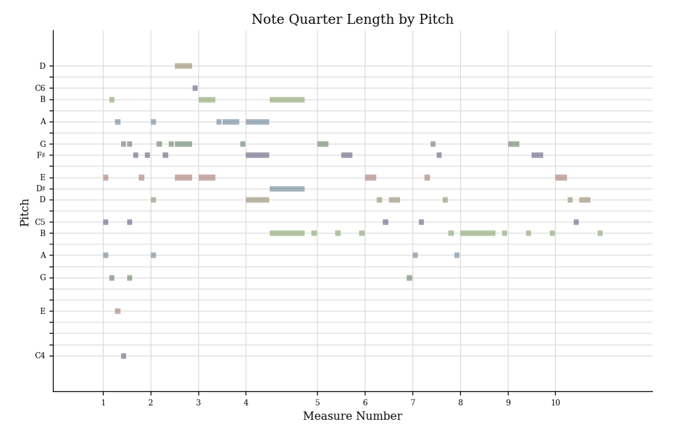
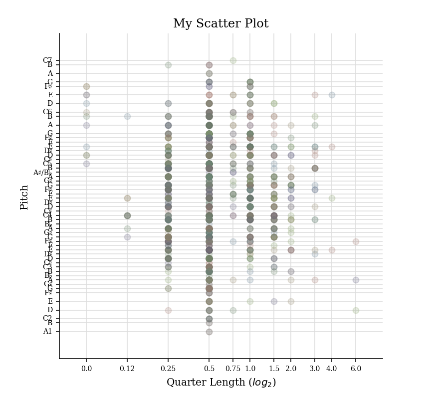

  # Music Curation and Analytics 2023 Lab Work
## Week 1 Lab
\
**Theme:** Studio Ghibli Music: Stage and Screen Music

The theme for my MCA project dataset is Studio Ghibli music collection composed by Joe Hisaishi, and the chosen music piece is a movie theme song from *Kiki's Delivery Service* by Hayao Miyazaki. Joe Hisaishi, a japanese composer, is known as the main music composer for Studio Ghibli and most of them are classical orchestrial music. His most remarkable collections are the pieces written for the animated movies: "One Spirited Away," "Sky Castle," "Howl's Moving Castle," "My Neighbour Totoro," etc. 

**Chosen source:** "A Town with an Ocean View"
**Composer:** Joe Hisaishi

**Musical Scores:** [Please view it here](https://github.com/siusei/MCA-2023/blob/master/data/OG_A_Town_with_an_Ocean_view.pdf)
**Audio Recordings:** [Audio from YouTube](https://www.youtube.com/watch?v=XavziZ-C6qY)

\
**Challenges to working with music and music-related data**

The problem to working with the music-related data is that at times it is tough to find the original source, specially when it is a popular piece. When I was finding piano or guitar scores, they often come in different versions where musicians tired to recreate music scores for others to be able to play the same piece of music if there isn’t an official versions yet. However, the recreated version, most of the time, does not include all musical elements compared to the original piece. Sometimes, even when there is an original music score, the rewrote versions and versions for different performers may affect searching results and increase difficulty to search for an official music score; this factor decreases accessibility to the visual musical data and it is time-consuming for users in need.

Taking my music score searching journey as an example. In my search for this piece, “A Town with an Ocean View” by Joe Hisaishi, on Musescore, it was challenging for me to identify whether or not there is an official score for this piece since there are overwhelming versions of this piece published by other users. Notated data and Acoustic data differs depend on how the score arrangers modify or mimic the original music piece. It took me some time to listen and compare which score sounds the most identical to the official piece. Furthermore, for other music score downloading platforms, some may require fee to purchase them or monthly fee before downloading music pieces. The financial barrier is also a factor that prevents users from accessing music data.

\
**Music Preservation of this Piece** 
*How data is presented, described, and analysed*
The music metadata are presented in forms like Ghibli movies soundtracks, musical scores, audio/video recordings, official live performances, covers, secondary video production. 
\
**1.Descriptive data**
\
Descriptive data includes this piece's song title, composer, performing artist, music genre, released date, track duration, users' rating, etc. These metadata are presented on different music streaming platforms like Spotify, Soundcloud, YouTube Music, etc. and they categorise this music based on the track's music genre, collection and popularity to generate music recommendations according to audiences' preferences. With these metadata, it will also be easier for audiences to search for this exact music piece on the search bar. For instance, my chosen music piece is a movie soundtrack and is classified as a classical music genre, for audiences who are a fan of Studio Ghibli movie or modern classical music and are not sure about the song title, audience can find it simply by searching related information on either of the music platforms or search engine. Additional background information can also be found on Google with Joe Hisaishi's creative process or audiences' music analysis of the piece.

\
**2.Notated data**
\
Notated data are the visual music score of the piece arranged by Joe Hisaishi or other arrangers who want to recreate new versions with different difficulty, performed medium, music genre, etc. Since I cannot find the official music score of the piece, I found this sheet music on the digital sheet music platform, MuseScore by filtering results with song title, composer, collection, instrument and difficulty. The search results appear an overwhelming number of modifyed versions of this single piece. Lots of them are almost identical to the original version and they also presents with solo, duets and orchestra versions.

\
**3.Acoustic data**
\
Acoustic data are audio track of the piece and it can be found on Youtube and the music streaming plarforms mentioned above in the forms of audio and video. The official soundtrack may also be a reusable and reliable souce for derivation creations including covers, medley, video production, improvisation and other art related production if this source is royalty-free.

## Week 2 Lab
\
This week I transcribed my chosen piece, *A Town with and Ocean View* with MuseScore and observed the accuracy of the MuseScore programme when transcribing a PDF file to a computer-readable MusicXML file. 

Here is an original PDF downloaded from MuseScore:
\

[Original - A Town with an Ocean View PDF](https://github.com/siusei/MCA-2023/blob/master/data/OG_A_Town_with_an_Ocean_view.pdf)
\
\
Here is the transcribed MusicXML file using MuseScore:
\
[MusicXML file of the piece](https://github.com/siusei/MCA-2023/blob/master/data/A_Town_with_an_Ocean_View_Transcribed_my.musicxml)
\
[Transcribed PDF file to view difference](https://github.com/siusei/MCA-2023/blob/master/data/PDF_A_Town_with_an_Ocean_View_Transcribed.pdf)

*From my observation*
The notation software of MuseScore can identify most of the music elements correctly. For instance, the majority of note pattern, beat sign, chords and music ornaments when the notes patterns are clear and repetitive.

However, sometimes, the software would mistakenly interpret bars with wrong beats and it does not recognise some elements like articulation sign and change of beat sign. 
Here are the specific errors spoted during observation:
    - Missing speed sign “rit…” and "93 bpm" in the first line
    - Duplicating bars in bars 70 and 71
    - Not recognising some changes in beat sign between bars 49 to 53
    - Not recognising some dots articulation.
    - Interpreted wrong beats and rest signs in Bar 62, 65, 66, and 78. 

## Week 3 Lab



## Week 4 Lab

### Generating piano roll and pitch histogram with Music21
\
**1.Piano Roll**

**2.Scatter Plot of Pitches**

**3.Histogram**

[Here is the link to my Week 4 Task if the images above are not visible](https://github.com/siusei/MCA-2023/tree/master#week-4-lab)

## Week 5 Lab
Embedding Metadata to my MEI document -

My audience:
- Fan of Studio Ghibli and classical music, movier lover and pianist.
Information added in the MEI document
- Title, composer, date of release, license and perform medium.

Here is the link to the MEI file updated with the metadata above:
<a href="/data/TWAOV_Meta.mei">A Town with an Ocean view updated MEI document</a>

